# Tab Management Browser Plugin - v1.0.0

<p align="center" style="padding-top: 10px; padding-bottom: 10px">
    
</p>

Tab manager plugin for Chromium browsers and Firefox. This release gives the user
a larger overview over active and archived tabs, as well the possibility
to arrange windows and tabs into folders - a convenient feature for those
who needs to launch different sessions for different purposes.

## Features

- Create folders (either new, or by using history or session as presets)
- Duplicate and merge folders
- Launch folders in incognito
- Launch folders as a collection/group (Chrome/Edge only)
- Search through folders, history and current session
- Simple sidepanel for core features
- Options page for expanded overview and more features


## Screenshots

<p align="center">
    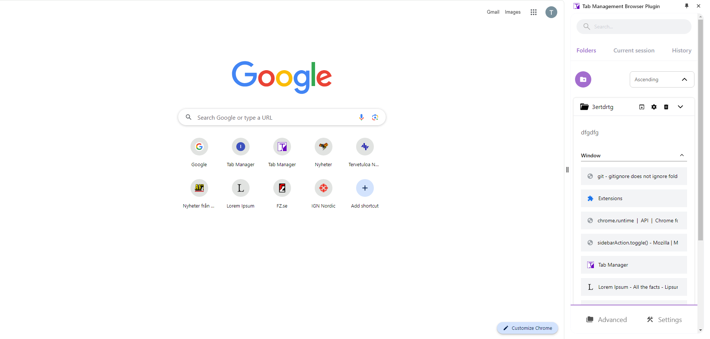 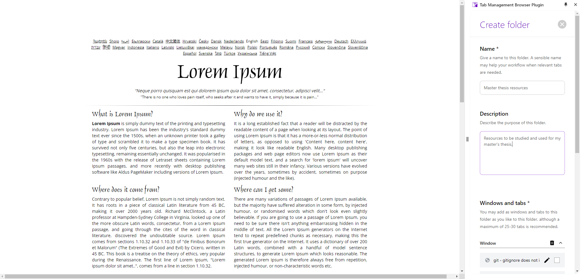 
    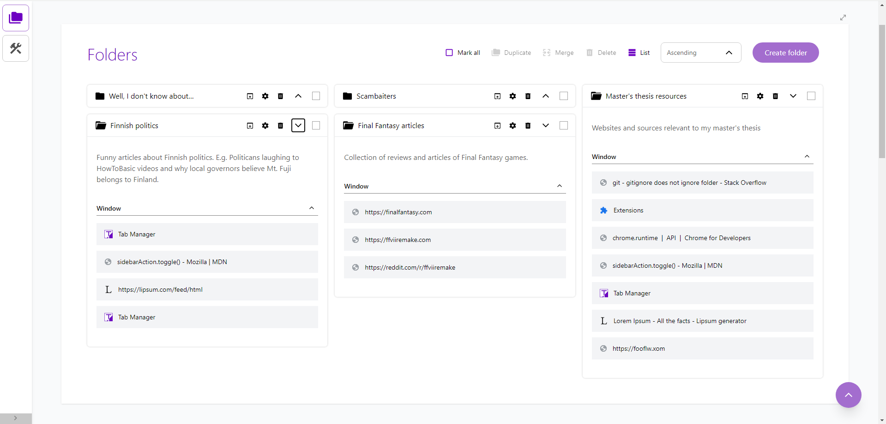 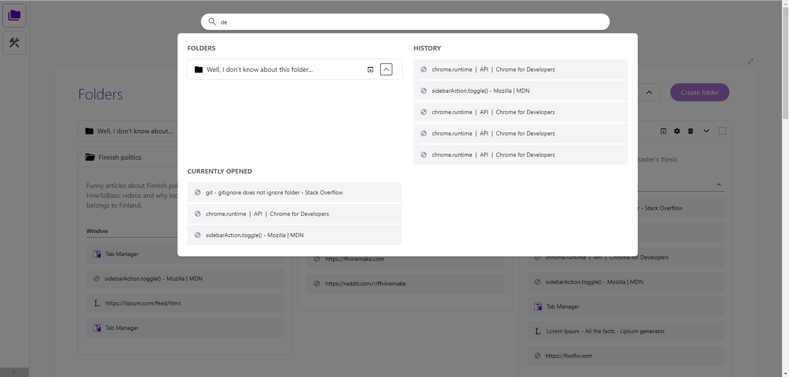 
    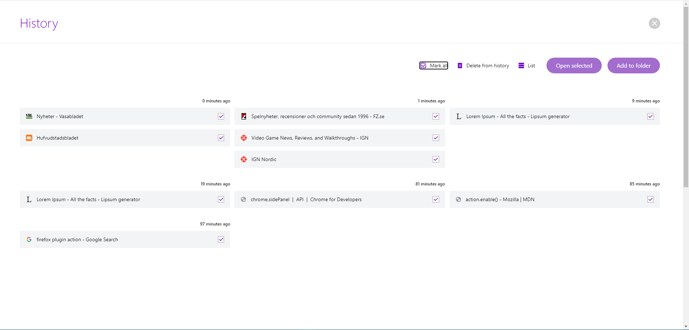 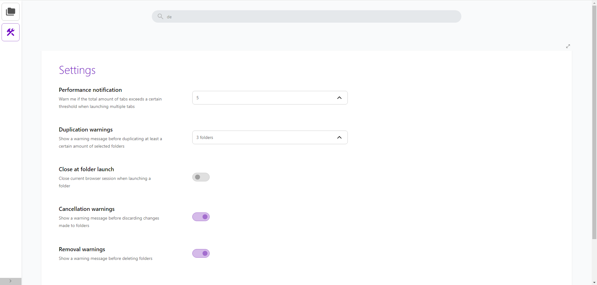 
    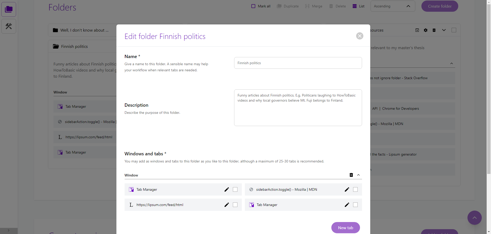 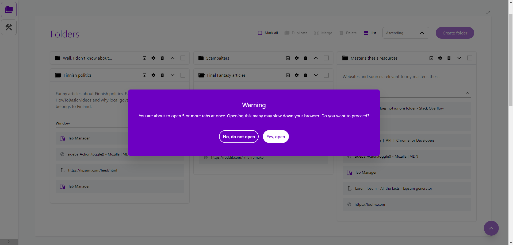 
    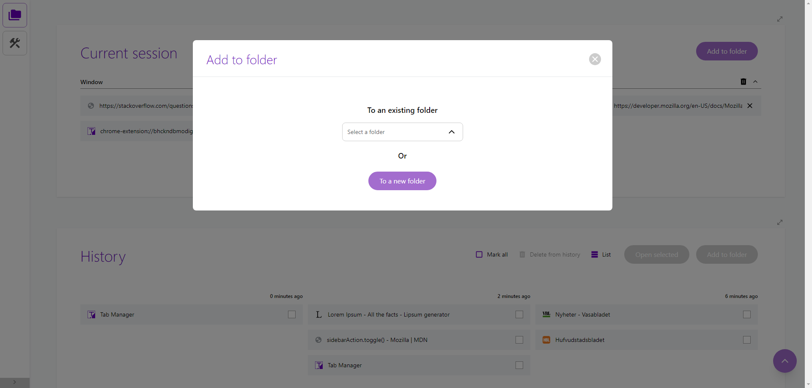 
</p>

## Programming and tools

HTML5, CSS3/SASS, Javascript/Typescript, React, Redux, JEST, Tailwind, Webextension API

## Usage

Once installed, you can pin this plugin to your browser's navigation bar. Both Chrome and Firefox has 
a pussle icon at the top right border, from where you can pin the plugin.

<p align="center">
    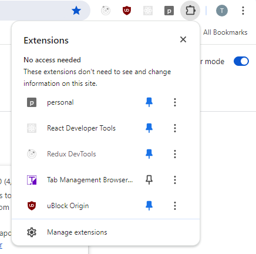
</p>

Clicking the pinned icon will toggle sidepanel for quick use. Should you need more features or better overview, click the "Advanced" button at the bottom of the sidepanel.

<p align="center">
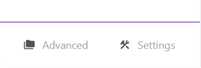
</p>

## Development

Although not necessary, sticking to the following would help keeping components clean and
organized.

- Try to avoid declaring components inside another component (JSX.Element).
- Consider refactoring components if they become too big or clumsy to work with (e.g. move large functions to their own files).
- Refactored/sub components should be placed in their own folders and follow a specific naming convention:


```
    ./src
        ...
        - components
            - utils
                - [my_component]
                    - [my_component].tsx
                    - functions
                        - a_component_specific_function.tsx
                        - a_event_handler.ts
                    - components
                        - child_component_a.tsx
                        - child_component_b.tsx
```

## Build

npm is required for this project.

Use the following commands to build:

### Development

These builds are meant to be loaded into browser's dev environment for manual testing. These builds aren't minified and retain all console.logs.

**Firefox**
```
npm run build-dev-firefox

```

_Output folder_:
- ./dist-dev-firefox

_Output packages_:
- firefox-dev-package.zip

_Load into browser_:

1. Open Firefox
2. Write _about:debugging_ into the address bar
3. Click _This Firefox_ in the left bar menu
4. Click _Load Temporary Add-on..._ button and head for the ./dist-dev-firefox folder
5. Click _manifest.json_ to load the unpackaged plugin into the browser


**Chrome**
```
npm run build-dev-chrome
```

_Output folder_:
- ./dist-dev-chrome

_Output packages_:
- chrome-dev-package.zip

_Load into browser_:

1. Open Chrome
2. Click the menu and head for _Extensions_ -> Manage Extensions_ 
3. Enable developer mode
4. Click _Load unpacked_
5. Head for the ./dist-dev-chrome folder and load it into the browser

### Production

**Firefox**
```
npm run build-prod-firefox
```

_Output folder_:
- ./dist-prod-firefox

_Output packages_:
- firefox-prod-package.zip

**Chrome**
```
npm run build-prod-chrome
```

_Output folder_:
- ./dist-prod-chrome

_Output packages_:
- chrome-prod-package.zip

## Test

```
npm run test
```

Run unit and integration tests (JEST). The tests are available in /src/\_\_tests_\_/. The coverage is presented in ./coverage/Icov-report/index.html

Run this command after changing existing components, to check if anything related to user interaction gets broken. Add new tests when adding new components or features. Each test should have clear description and have a relevant purpose (mere coverage hunting does not count...)

# QA

### Why can I not find this plugin in Chrome Web Store/Firefox AMO?
For the time being, this plugin is meant for my own personal use and is also part of my portfolio. I may publish it to the stores at a later time once I've figured out how to improve the plugin beyond what's already provided through the store. If you're still interested in using this plugin, I suggest you download a browser package from one of the releases.

### Will there be any updates/new features?
New features may be added as I get new ideas or feedback/suggestions that could be of value for significant improvement. Smaller bug fixes and enhancements may be published from time to time, with no set schedule nor roadmap at this point.

# Contact information
Email: privat_thai_nguyen@hotmail.com

# Copyright &copy; Thai Nguyen
See LICENSE.md for more information.