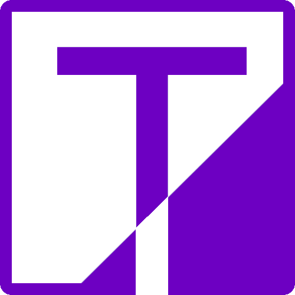

# Tab Management Browser Plugin (In development)

<p align="center" style="padding-top: 10px; padding-bottom: 10px">
    
</p>

This plugin gives you a better overview and improved tab management experience not provided
by default browser features.

## Screenshots

   

## Features

- Create and edit folders
- Duplicate and merge folders
- Launch folders in either incognito or as groups
- Tab suspension (upcoming)
- Simplistic sidepanel, for quick overview
- Options page for expanded overview

## Programming and tools

HTML5, CSS3/SASS, Javascript/Typescript, React, Redux, JEST, Tailwind, Webextension API

## Installation

- Firefox: No releases as of now
- Chrome: No releases as of now
- Microsoft Edge: No releases as of now

## Development

All folders and files follows the following format: __[my-file-name.tsx]__

### Component guidelines

- Try to avoid declaring components inside another component (JSX.Element).
- Consider refactoring components if they become too big or clumsy to work with (e.g. move large functions to their own files).
- Refactored/sub components should be placed in their own folders and follow a specific naming convention:

```
    ./src
        ...
        - components
            - utils
                - [my_component]
                    - [my_component].tsx
                    - functions
                        - a_component_specific_function.tsx
                        - a_event_handler.ts
                    - components
                        - child_component_a.tsx
                        - child_component_b.tsx
```

### Commands

Before you begin, make sure Node Package Manager (npm) is installed on your computer. The build and testing
commands depend on this.


__Build__

```
npm run build-dev
```

The build will be available in the ./dist folder. This folder can be loaded
as a unpacked webextension into the browser. This folder is also used when packaging the extension
for distribution.

NOTE: There is no bundling as of now, nor production build at the moment. Those will be added at a later time

__Test__

```
npm run test
```

Run unit and integration tests (JEST). The tests are available in /src/__tests__. The coverage is presented in ./coverage/Icov-report/index.html

Run this command after changing existing components, to check if anything related to user interaction gets broken. Add new tests when adding new components or features. 

### Install unpacked dev version in Chrome or Edge

1. Clone this repository to a folder on your computer
2. Open Google Chrome (preferably. Optimization for Firefox and Edge will be done at a later time)
3. Build the project
3. Go to Chrome's menu -> Extensions -> Manage Extension
4. Turn on Developer mode and click "Load unpacked"
5. Head for ***/tabfolders/dist/*** and select it

- __Open options page:__ Click "Details" in the extension's box. Scroll down and click "Extension options"
- __Open the sidepanel:__ Click the  icon in your browser's toolbar

# Updates
Minor updates and improvements will be provided from time to time. There is no definite roadmap or schedule.

# Feedback
I would appreciate feedback and suggestions on how to improve this plugin. Reports of possible bugs are also welcome. Please, post an issue or contact me per email: privat_thai_nguyen@hotmail.com

# Contact information
Email: privat_thai_nguyen@hotmail.com

# Copyright &copy; Thai Nguyen
This plugin is free for private and professional use, with no limitations nor warranty. The plugin itself and code deriving from it may not be monetized, re-distributed, nor used as part of commercial products/services/brands.